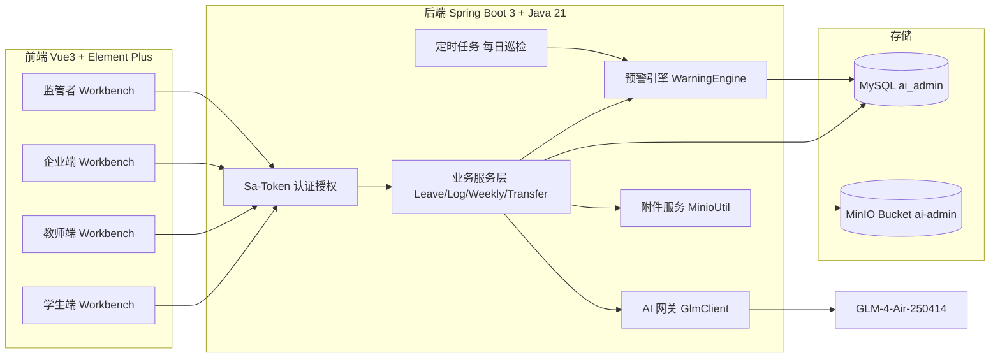
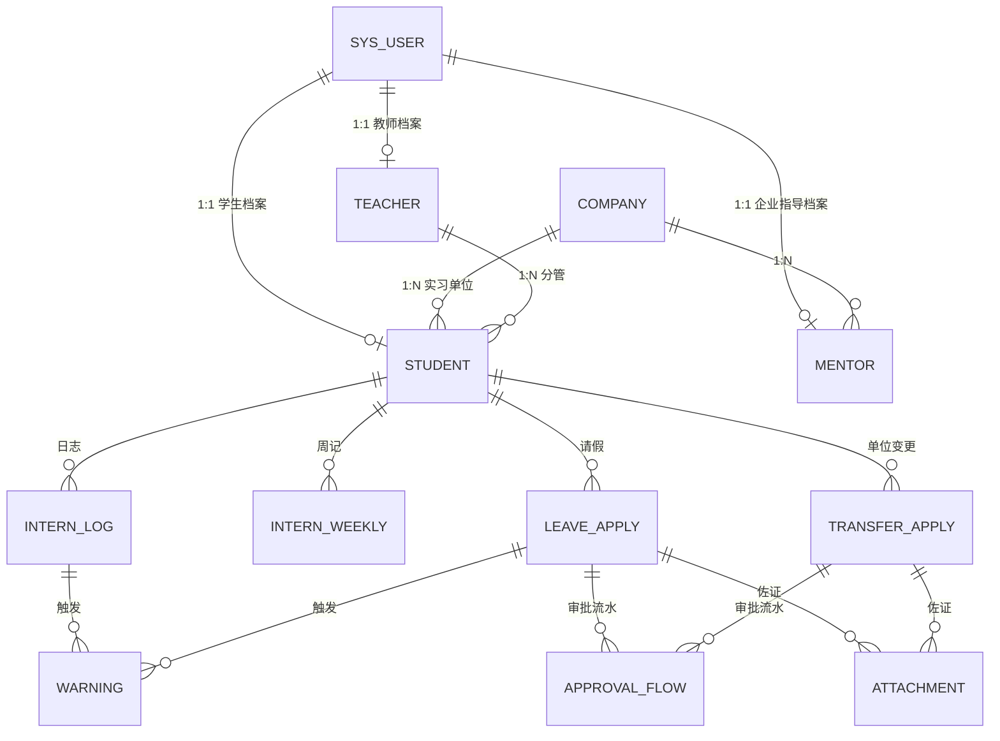
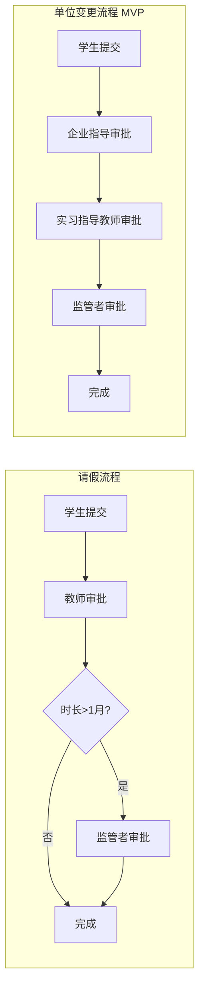
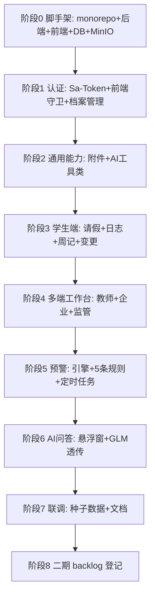

# 实习管理 AI 智能体系统 — MVP 架构方案

> 版本：MVP-v1.0  
> 范围：4 角色登录 + 基础工作台 + 4 个核心表单（请假/日志/周记/单位变更）+ 简单 AI 问答 + 三色预警  
> 技术栈：Vue3 + Element Plus + ECharts (pnpm) ｜ Spring Boot 3.x + Java 21 + MyBatis-Plus + Sa-Token + MinIO + MySQL ｜ GLM-4-Air-250414

---

## 1. 整体架构



---

## 2. 角色与数据隔离

| 角色 | Sa-Token role | 数据可见范围 |
|------|---------------|--------------|
| 监管者 supervisor | `supervisor` | 全局 |
| 实习指导教师 teacher | `teacher` | 仅查看 `student.teacher_id = 当前教师` 的学生 |
| 实习学生 student | `student` | 仅自己 |
| 企业指导人员 mentor | `mentor` | 仅 `student.company_id = 当前企业绑定` 的学生 |

> 隔离策略：MyBatis-Plus 拦截器 + Service 层 `currentUser()` 二次校验，避免越权。

---

## 3. 数据库设计（MVP 12 张核心表）



| 表名 | 说明 | 关键字段 |
|------|------|----------|
| `sys_user` | 全角色统一账号表 | id, username, password(BCrypt), role, status |
| `student` | 学生档案 | user_id, name, age, grade, teacher_id, company_id |
| `teacher` | 教师档案 | user_id, name, phone |
| `mentor` | 企业指导档案 | user_id, name, company_id, phone |
| `company` | 实习企业档案 | id, name, industry, city, is_blacklist |
| `leave_apply` | 请假申请 | id, student_id, type, start_at, end_at, days, reason, status, current_node |
| `intern_log` | 实习日志 | id, student_id, log_date, content, ai_sensitive_words(JSON) |
| `intern_weekly` | 实习周记 | id, student_id, week_no, content, ai_sensitive_words(JSON) |
| `transfer_apply` | 单位变更申请 | id, student_id, old_company_id, new_company_id, reason, status, current_node |
| `approval_flow` | 通用审批流水 | id, biz_type, biz_id, node_no, approver_role, approver_id, action, comment, time |
| `attachment` | 附件元数据 | id, biz_type, biz_id, object_key, original_name, size, mime |
| `warning` | 预警记录 | id, level(R/Y/G), source_type, source_id, target_role, target_id, content, status |
| `ai_call_log` | AI 调用日志 | id, scene, prompt, response, tokens, cost_ms |

---

## 4. 认证与权限（Sa-Token）

- 登录 `POST /auth/login` → 返回 `tokenName/tokenValue`
- 前端 Axios 拦截器自动注入 `satoken: xxx`
- 后端控制器通过注解保护：
  - `@SaCheckRole("student")`
  - `@SaCheckRole(value = {"teacher","supervisor"}, mode = SaMode.OR)`
- 全局 `Sa-Token Filter` 统一异常 → 返回 401，前端跳登录

---

## 5. 审批流（MVP 简化）

> MVP 采用**串行审批**简化模型；二期再扩展并行会签。



> 实现：`approval_flow` 表 + 状态机；`current_node` 推进；任意节点驳回 → 状态回 `REJECTED`，学生可修改后重新提交（生成新流水）。

---

## 6. 三色预警引擎（MVP 5 条规则）

| 编号 | 触发场景 | 等级 | 实现位置 |
|------|----------|------|----------|
| R1 | 日志/周记 GLM 敏感词检测命中 | 🔴 红 | 提交时同步触发 |
| R2 | 请假时长 > 3 月 | 🔴 红（阻断） | 表单提交校验 + 后端二次校验 |
| R3 | 选择企业命中黑名单 `company.is_blacklist=1` | 🔴 红（阻断变更） | 单位变更提交校验 |
| Y1 | 学生连续 3 天无日志 | 🟡 黄 | 每日 02:00 定时任务扫表 |
| Y2 | 单位变更申请 > 3 天未审批推进 | 🟡 黄 | 每日定时任务扫 `approval_flow` |

> 触发后写入 `warning` 表，对应角色工作台轮询 `GET /warning/mine?level=R|Y` 拉取，列表头部红点提示。

---

## 7. AI 集成（GLM-4-Air-250414）

```java
// 统一封装 GlmClient
public interface GlmClient {
    String chat(List<Message> messages);          // /ai/chat 透传
    List<String> detectSensitive(String text);    // 日志/周记敏感词识别
}
```

- 配置走 `application.yml`：
  ```yaml
  glm:
    endpoint: https://open.bigmodel.cn/api/paas/v4/chat/completions
    api-key: b0d4a22bfa6349b58078594262142393.ia4mTZa
    model: GLM-4-Air-250414
  ```
- 敏感词检测 system prompt：内置"违规用工/收押金/夜班/强制加班/人身受伤"等关键词指引，返回 JSON 数组
- 问答 MVP 不做向量 RAG，仅在 system prompt 中拼入《实习管理办法》关键条款摘要（约 2K tokens）

---

## 8. 附件存储（MinIO）

- bucket：`ai-admin`，按 `biz_type/yyyyMM/uuid.ext` 组织对象 key
- 上传：`POST /file/upload`（multipart）→ 返回 `{fileId, previewUrl(预签名2h)}`
- 表单提交时只传 `fileId[]`，由 `attachment` 表绑定到具体业务记录
- 前端复用 `<ImageUploader v-model="fileIds" :max="5" />` 组件

---

## 9. 工程目录结构

```
ai-admin/
├── docker-compose.yml          # MySQL + MinIO 一键起
├── pnpm-workspace.yaml
├── plans/
│   ├── mvp-architecture.md     # 本文档
│   └── phase2-backlog.md       # 二期 backlog
├── docs/
│   └── api/                    # Knife4j 导出
├── backend/
│   ├── pom.xml
│   └── src/main/java/com/zr/aiadmin/
│       ├── AiAdminApplication.java
│       ├── config/             # SaTokenConfig, MinioConfig, MybatisPlusConfig, GlmConfig
│       ├── common/             # R<T>, BizException, GlobalExceptionHandler, BaseEntity
│       ├── controller/         # auth/student/teacher/mentor/supervisor/file/ai/warning
│       ├── service/ + impl/
│       ├── mapper/
│       ├── entity/             # 12 张表对应实体
│       ├── dto/                # 入参/出参
│       ├── ai/                 # GlmClient + SensitiveDetector
│       ├── warning/            # WarningEngine + 5 条规则实现类
│       ├── approval/           # ApprovalEngine 状态机
│       └── schedule/           # DailyInspectJob
│   └── src/main/resources/
│       ├── application.yml / application-dev.yml
│       ├── db/schema.sql + data.sql
│       └── mapper/             # MP XML（如需复杂SQL）
└── frontend/
    ├── package.json
    ├── vite.config.ts
    └── src/
        ├── api/                # axios 模块化接口
        ├── components/         # ImageUploader, ApprovalTimeline, WarningBadge, AiChatBox
        ├── layouts/            # 4 套布局：StudentLayout / TeacherLayout / MentorLayout / SupervisorLayout
        ├── views/
        │   ├── login/
        │   ├── student/        # log, weekly, leave, transfer
        │   ├── teacher/        # workbench, approval-center
        │   ├── mentor/         # attendance, transfer-approval
        │   └── supervisor/     # workbench, warning-stream
        ├── router/             # 按角色守卫 + 动态菜单
        ├── store/              # user, warning(轮询)
        ├── utils/              # request.ts(axios), auth.ts
        └── main.ts
```

---

## 10. 关键 API 一览（MVP）

| 模块 | 方法 | 路径 | 说明 |
|------|------|------|------|
| 认证 | POST | `/auth/login` | 登录返回 token + role |
| 认证 | POST | `/auth/logout` | 登出 |
| 认证 | GET  | `/auth/me` | 当前用户 + 角色 + 菜单 |
| 文件 | POST | `/file/upload` | 通用图片上传 |
| 文件 | GET  | `/file/{id}/url` | 获取预签名预览 URL |
| 学生 | POST | `/student/log` | 提交日志（同步触发敏感词检测+预警） |
| 学生 | POST | `/student/weekly` | 提交周记 |
| 学生 | POST | `/student/leave` | 提交请假，>3 月返回 422 |
| 学生 | POST | `/student/transfer` | 提交单位变更，黑名单返回 422 |
| 教师 | GET  | `/teacher/approval/pending` | 待审批列表 |
| 教师 | POST | `/teacher/approval/{flowId}` | 通过/驳回 |
| 教师 | GET  | `/teacher/students` | 分管学生（带三色） |
| 企业 | POST | `/mentor/attendance/batch` | 一键全员在岗 |
| 企业 | POST | `/mentor/approval/{flowId}` | 单位变更审批 |
| 监管 | GET  | `/supervisor/dashboard` | 全局三色统计 |
| 监管 | GET  | `/supervisor/warning/stream` | 预警事件流 |
| 预警 | GET  | `/warning/mine` | 当前角色待处理预警，前端轮询 30s |
| AI   | POST | `/ai/chat` | 政策问答透传 GLM |

> 统一返回结构：`{ code: 0, msg: "ok", data: T }`；异常用全局 `BizException` 抛出。

---

## 11. 开发执行顺序



---

## 12. MVP 验收清单

- [ ] 4 类角色账号均能登录并看到对应工作台
- [ ] 学生可上传带图请假，>1 月强制家长材料，>3 月被阻断
- [ ] 学生提交日志/周记后，命中敏感词的字段在列表中高亮，并产生红色预警
- [ ] 学生发起单位变更，依次走完 企业→教师→监管 三节点审批
- [ ] 教师工作台分管学生列表显示三色徽章，弹窗能看到判定规则说明
- [ ] 企业端"一键全员在岗"可批量写入当日考勤
- [ ] 监管者工作台首页看到全局红/黄/绿统计 + 预警事件流（已审/未审日志标签区分）
- [ ] 任意角色点击右下 AI 按钮可与 GLM 政策问答
- [ ] 每日 02:00 定时任务跑通：连续 3 天未交日志生成黄色预警

---

## 13. 二期 backlog（不在本期实现）

将记录于 [`plans/phase2-backlog.md`](phase2-backlog.md:1)，包含：
- 剩余 10 套官方附件表单数字化
- RAG 向量知识库（14 份制度文件全文检索）
- 用工红线/薪酬合规规则、自动巡检全量规则
- ECharts 可视化看板（行业/城市/地图）
- 电子档案打包（9 项材料归集，3 年留存）
- 公文自动生成（教务处/教育厅上报）
- 语音转文字、Excel/PDF 导出
- 单位变更并行会签（教师 ‖ 企业）
- 安全打卡 + 应急 SOP（台风等）
- SSE 实时推送替换轮询
- AI 实习成绩辅助核算